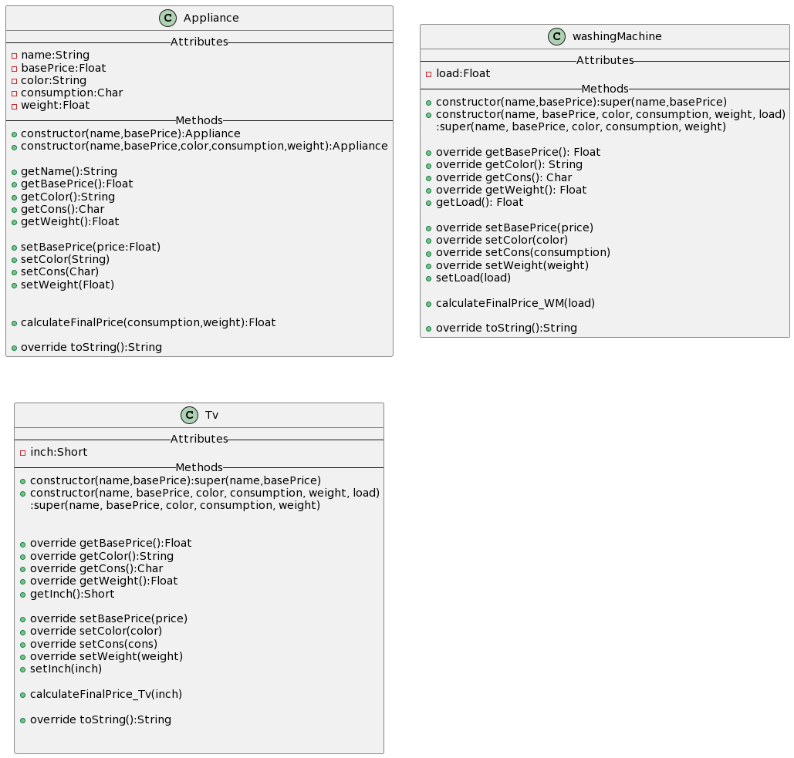

# PROJECT: ApplianceArchitect  🏠

## Overview 👀
This is an educational project whose purpose is to practice and become familiar with object-oriented programming (OOP).
## Project Description ✍🏼
This application contains 3 types of objects: appliances, washing machines, and televisions. It involves initializing them, changing their default values, and printing them after performing some simple calculations.
## UML 📙

> [!NOTE]
> This Project has been built with Gradle and Amazon Coretto 17

